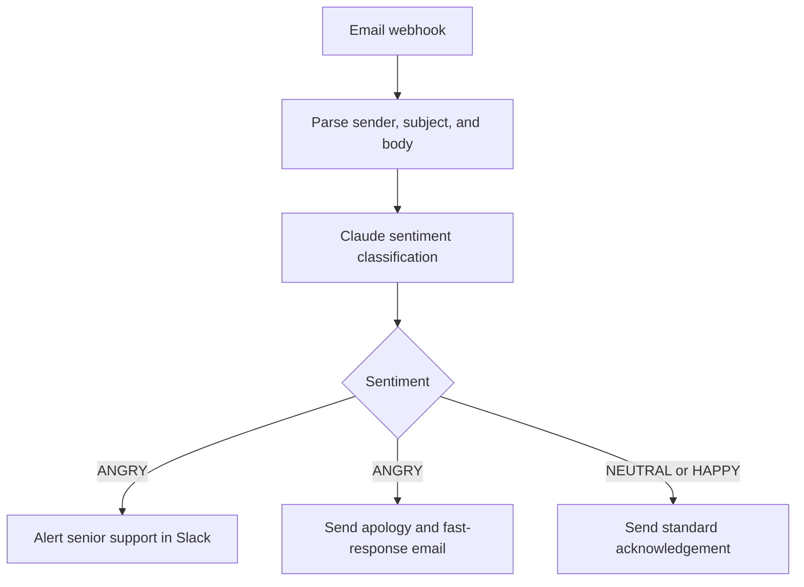

# Email Sentiment-Triggered Escalation

Detects angry customer emails with Claude and escalates them to senior support automatically.

 -333?style=flat-square)  


---

**[Open the visual project page →](./index.html)**

## Table of Contents

- [Overview](#overview)
- [Architecture](#architecture)
- [Workflow](#workflow)
- [Tech Stack](#tech-stack)
- [Demo status](#demo-status)
- [Setup](#setup)
- [Repository Structure](#repository-structure)
- [Disclaimer](#disclaimer)

## Overview

**Trigger:** Webhook (email: from, subject, body)

Detects angry customer emails with Claude and escalates them to senior support automatically.

### Key Features

- Single-word sentiment classification (cheap, fast)
- Automatic senior-support escalation
- Differentiated response templates by sentiment

## Architecture

The diagram below represents the sanitized template flow. External services, credentials, and environment-specific identifiers must be configured before execution.



## Workflow

1. Email sentiment webhook receives the message
2. Parse sender, subject, and body
3. Claude classifies sentiment as ANGRY / NEUTRAL / HAPPY
4. Angry: alert senior support in Slack and send an apology + fast-response email
5. Otherwise: send a standard acknowledgement email

## Tech Stack

- n8n
- Claude (Anthropic API)
- Slack
- SendGrid

## Demo status

A configured live-run recording is not included yet. Credentials and service identifiers remain placeholders.


## Setup

1. Import `workflow/T13_Email_Sentiment_AI_Response.json` into your n8n instance (**Workflows → Import from File**).
2. Replace every placeholder credential/URL in the workflow (e.g. `YOUR_..._API_KEY`, `YOUR_..._URL`) with your own service credentials.
3. Activate the workflow and point the relevant integration (webhook source, scheduled trigger, etc.) at the generated webhook URL.
4. Test with a sample payload before going live.

## Repository Structure

```text
.
├── index.html
├── README.md
├── LICENSE
├── .gitignore
└── workflow/
    └── T13_Email_Sentiment_AI_Response.json
```


## Disclaimer

This workflow was built as a portfolio/template project to demonstrate n8n workflow automation and AI integration. API credentials and sensitive configuration have been removed before publication — replace all `YOUR_..._KEY` / `YOUR_..._URL` placeholders with your own before use.

---

Designed and engineered by

**Oyekola Ololade**

AI Systems & Integration Engineer

- LinkedIn: <http://linkedin.com/in/ololade-oyekola-5b1797397>
- Email: <oyekolaololade69@gmail.com>
